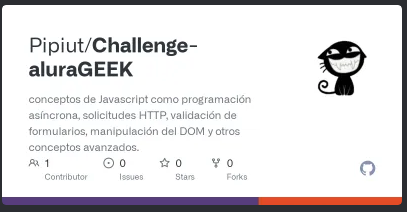

   

# Challenge-aluraGEEK

</img>

# descripción-del-proyecto
<h3 align="left">Description</h3>

 <h2 align="left">
 Conceptos de Javascript como programación asíncrona, solicitudes HTTP, validación de formularios, manipulación del DOM y otros conceptos avanzados.
 </h2>

# índice
<h3 align="left">Index</h3>

# acceso-al-proyecto
<h3 align="left">View</h3>

https://pipiut.github.io/Challenge-aluraGEEK/

aluraGEEK-challenge-beta.vercel.app

# Instalacion

<h3 align="left">Installation</h3>

* npm install

* npm run server

* npx json-server --watch db.json --port 3001

# tecnologías-utilizadas

<h3 align="left">Languages and Tools:</h3>

# personas-desarrolladores

<h3>Maria Cristina Gutierrez</h3>

* [Licencia](#licencia)
